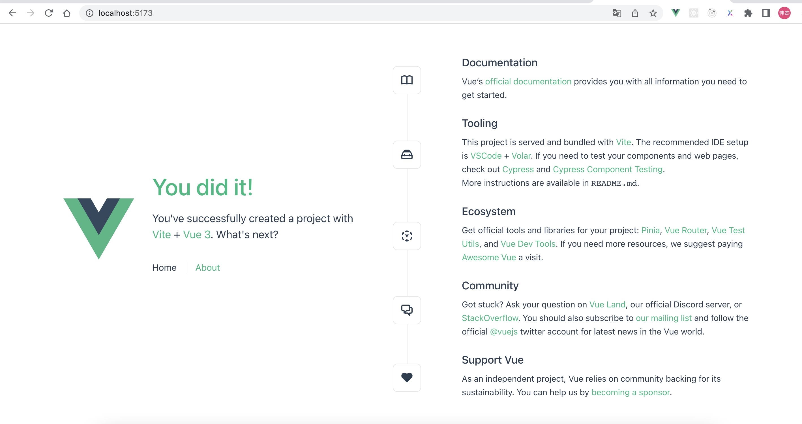

## 安装 vue

https://cn.vuejs.org/guide/quick-start.html

```
npm init vue@latest

```


分别执行以下命令

```
cd vue-project
npm install
npm run dev
```



## echarts 安装依赖

https://echarts.apache.org/handbook/zh/basics/import

```
npm install echarts --save
```

## 引入方式

1. 全量引入(不建议)
2. 按需引入(减少包体积,建议)
